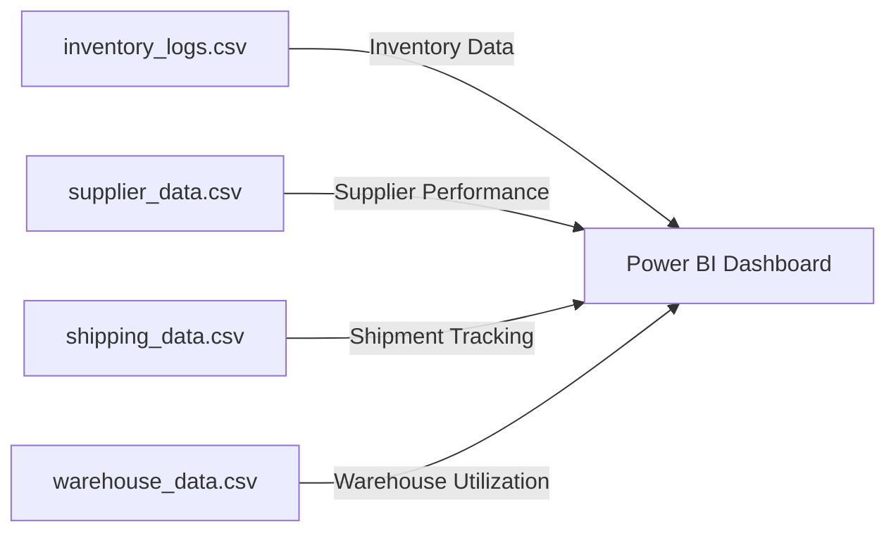

# Supply Chain & Inventory Optimization Dashboard

## 📊 Executive Summary

An interactive Power BI dashboard providing real-time supply chain analytics with current metrics:
- Total Stock Value: 1.34M
- Inventory Turnover Rate: 5.79
- Supplier Performance Score: 3.71
- On-Time Shipment Rate: 84.00%
- Warehouse Utilization: 77.08%
  
## ⚡Dashboard Components

### Supply Chain Overview


### 📐 Data Cleaning & Transformation

#### 1. Inventory Data (inventory_logs.csv)

✅ Convert Data Types:
- Product_ID → Text
- Product_Name, Category → Text
- Stock_Level, Reorder_Point → Whole Number
- Inventory_Turnover → Decimal Number

✅ Handle Missing Data:
- Replace null values in Stock_Level and Reorder_Point with median values.

✅ Add a New Column - Stock Status:
```powerquery
Stock_Status = 
    if [Stock_Level] < [Reorder_Point] 
    then "Reorder Needed" 
    else "Sufficient Stock"
```

#### 2. Supplier Ratings (supplier_data.csv)
✅ Convert Data Types:
- Supplier_ID, Supplier_Name → Text
- Lead_Time_Days → Whole Number
- Delivery_Accuracy, Supplier_Rating → Decimal Number

✅ Fix Outliers in Supplier Rating:
- Ensure Supplier_Rating is within 2.5 to 5.0 (remove extreme values).

✅ Create a Performance Category Column:
```powerquery
Performance_Category = 
    if [Supplier_Rating] >= 4.5 then "Excellent"
    else if [Supplier_Rating] >= 3.5 then "Good"
    else "Needs Improvement"
```
#### 3. Shipping & Logistics Data (shipping_data.csv)

✅ Convert Data Types:
- Shipment_ID, Origin, Destination → Text
- Shipping_Cost, Delivery_Time_Days → Decimal Number
- Delay_Flag → Text

✅ Create Delay Category:
```powerquery
Delay Category = if [Delay_Flag] = "Yes" then "Delayed" else "On Time"
```

#### 4. Warehouse Utilization (warehouse_data.csv)

✅ Convert Data Types:
- Warehouse_ID, Warehouse_Location → Text
- Storage_Capacity, Current_Utilization → Whole Number

✅ Calculate Warehouse Utilization Percentage:
```powerquery
Utilization Percentage = ([Current_Utilization] / [Storage_Capacity]) * 100
```

✅ Add Warehouse Status Category:
```powerquery
Warehouse Status = if [Utilization Percentage] >= 90 then "Overloaded" 
                   else if [Utilization Percentage] >= 60 then "Optimized"
                   else "Underutilized"
```

## 🎯 Key DAX Measures

### 1. Inventory Management
```dax
// Total Stock Value
Total_Stock_Value = 
SUMX(
    Inventory_Logs,
    Inventory_Logs[Stock_Level] * Inventory_Logs[Cost_Per_Unit]
)

// Inventory Turnover Rate
Inventory_Turnover_Rate = 
AVERAGE(Inventory_Logs[Inventory_Turnover])

// Stock Status Calculation
Stock_Status = 
SWITCH(
    TRUE(),
    [Stock_Level] < [Reorder_Point], "Reorder Needed",
    [Stock_Level] >= [Reorder_Point], "Sufficient Stock"
)
```

### 2. Supplier Performance
```dax
// Supplier Rating Average
Supplier_Performance_Score = 
AVERAGE(Supplier_Data[Supplier_Rating])

// Lead Time Analysis
Avg_Lead_Time = 
AVERAGE(Supplier_Data[Lead_Time_Days])

// Delivery Performance
On_Time_Delivery_Rate = 
DIVIDE(
    COUNTROWS(FILTER(Shipping_Data, Shipping_Data[Delay_Flag] = "No")),
    COUNTROWS(Shipping_Data),
    0
) * 100
```

### 3. Shipping Analytics
```dax
// Shipping Performance
Delayed_Shipment_Percentage = 
DIVIDE(
    CALCULATE(COUNT(shipping_data[Shipment_ID]), shipping_data[Delay_Flag] = "Yes"),
    COUNT(shipping_data[Shipment_ID]),
    0
)

// Total Shipments Tracking
Total_Shipments = 
COUNT(shipping_data[Shipment_ID])
```

#### Key Metrics
- Total Shipments: 200
- Delayed Percentage: 0.16
- Average Supplier Rating: 3.71
- Average Lead Time: 17.60 days
- On-Time Percentage: 0.84


## 📈 Dashboard Visualizations

### 1. Supplier Performance Table

```yaml
Type: Table Visual
Configuration:
  Columns:
    - Supplier_Name
    - Lead_Time_Days
    - Delivery_Accuracy
    - Supplier_Rating
    - Performance_Category
```

#### Supplier Performance Table
| Performance Level | Rating Range | Count | Color Code |
|------------------|--------------|--------|------------|
| Excellent        | ≥ 4.5        | 5      | 🟢 Green   |
| Good             | 3.5 - 4.4    | 6      | 🟡 Yellow  |
| Needs Improvement| < 3.5        | 9      | 🔴 Red     |

Top Performers:
1. Daugherty, Ramos and Anderson (4.97)
2. Soto-Clements (4.97)
3. Hernandez and Sons (4.87)
4. Kelly, Brown and Hoawrd (4.77)
5. Gonzalez and Sons (4.53)

### 2. Stock Level Analysis


```yaml
Type: Clustered Bar Chart
Configuration:
  X-Axis: Stock_Level
  Y-Axis: category
  Color: Stock_Status
Current Levels:
  - Food: 7.1K units
  - Pharmaceuticals: 4.5K units
  - Furniture: 4.5K units
  - Electronics: 4.3K units
  - Clothing: 3.5K units
```

#### Reorder Status
- 🟢 Green: Sufficient Stock
- 🔴 Red: Reorder Needed

#### Current Stock Levels by Category
```
Category         Stock Level    Status
Food            7.1K units     ■ Sufficient Stock
Pharmaceuticals 4.5K units     ■ Sufficient Stock
Furniture       4.5K units     ■ Sufficient Stock
Electronics     4.3K units     ■ Sufficient Stock
Clothing        3.5K units     ■ Sufficient Stock

Category         Stock Level    Status
Food            0.1K units     ■ Reorder Needed
Pharmaceuticals 0.2K units     ■ Reorder Needed
Furniture       0.0K units     ■ Reorder Needed
Electronics     0.1K units     ■ Reorder Needed
Clothing        0.2K units     ■ Reorder Needed
```

### 3. Shipment Performance


```yaml
Type: Donut Chart
Configuration:
  Values: Shipment_ID
  Legend: Delay_Flag
  Colors:
    - On-Time: 🟢 Green 
    - Delayed: 🔴 Red
Current Distribution:
  - On-Time: 168 (84%)
  - Delayed: 32 (16%)
```

Donut Chart Distribution:
- On-Time: 168 shipments (84%)
- Delayed: 32 shipments (16%)
- Total: 200 shipments

### 4. Geographic Warehouse Distribution


```yaml
Type: Map Visual
Configuration:
  Location: Warehouse_Location
  Latitude: LAatitude
  Longitude: Longitude
  Size: Storage_Capacity
  Color: Utilization_Percentage
  Bubbles: True
```

| Location | Storage_Capacity | Utilization_Percentage | Color Code |
|------------------|--------------|--------|------------|
| Hayneston      | 3322       | 268.12      | 🟢 Green   |
| Lake michaelfort           | 9363    | 8.85      | 🔴 Red |

### 5. Stock Forecast


```yaml
Type: Line Chart with Forecast
Configuration:
  X-Axis: Date (Jan 05 - Feb 16)
  Y-Axis: Stock_Level
  Forecast: 7 days
  Confidence: 95%
```
Metrics:
  - Peak: 1.7K units
  - Minimum: 0.2K units


## 🔧 Technical Implementation

### Data Sources


## 📈 Future Stock Level Forecast

The dashboard includes a time series forecast showing:
- Historical stock levels from Jan 05 to Feb 09
- Forecast period: Feb 09 to Feb 16
- Confidence interval shown in purple shading
- Peak stock levels around 1.7K units
- Minimum levels around 0.2K units

## 🚀 Setup Instructions

1. Power BI Setup:
   - Open Power BI Desktop
   - Load data files from Data/ folder
   - Apply transformations using Power Query Editor
   - Create necessary measures
   - Import custom themes if needed

2. Refresh Settings:
   - Stock Levels: Real-time
   - Supplier Ratings: Weekly
   - Shipping Data: Daily
   - Warehouse Utilization: Hourly

## 📋 Prerequisites

- Power BI Desktop (Latest Version)
- Access to source data systems
- Power BI Pro license for sharing

## 🔄 Planned Enhancements

1. Automated Alerts:
   - Low stock notifications
   - Supplier performance alerts
   - Delivery delay warnings

2. Advanced Analytics:
   - AI-powered demand forecasting
   - ARIMA modeling
   - Prophet forecasting
   - LSTM implementation

3. Integration Features:
   - Live database connection
   - Real-time data streaming
   - Mobile app integration

 ## 🛠 Troubleshooting

Common Issues & Solutions:
1. Data Refresh Failures:
   - Check data source connections
   - Verify credentials
   - Review error logs

2. Performance Issues:
   - Optimize DAX queries
   - Use incremental refresh
   - Monitor resource usage 

## 📝 Contributing

Contributing:
1. Fork repository
2. Create feature branch
3. Submit pull request

---
For technical support or questions, contact: jena02605@gmail.com
